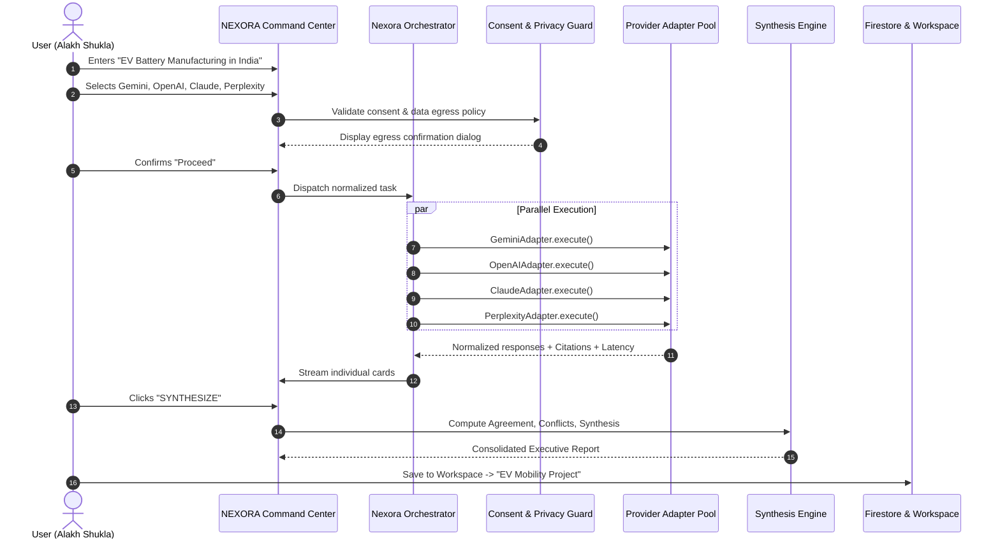
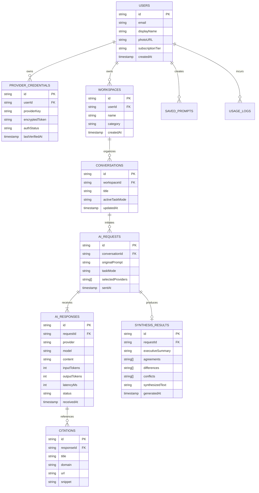
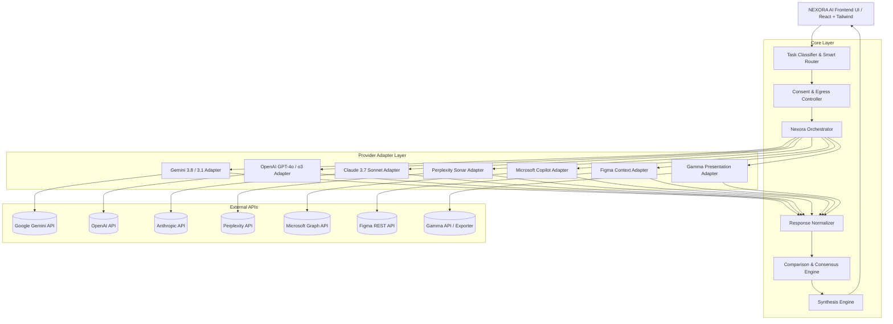

# NEXORA AI — System Architecture & Product Specification
**"One prompt. Every intelligence."**
*Created by Alakh Shukla*

---

## 1. Complete Product Specification

### 1.1 Executive Summary
NEXORA AI is a unified multi-provider AI command center and orchestration platform designed to break down the silos of heterogeneous AI services. Rather than forcing knowledge workers, researchers, engineers, and decision-makers to manually query Google Gemini, OpenAI ChatGPT, Anthropic Claude, Perplexity, Microsoft Copilot, Figma, and Gamma across isolated browser tabs, NEXORA AI allows users to author a single high-intent prompt, route it to selected or auto-determined intelligences, execute calls in parallel, normalize the incoming responses into a standardized schema, and synthesize agreements, divergences, unique insights, and citations into an actionable workspace.

### 1.2 Core Product Tenets
1. **Multi-Intelligence Orchestration:** Query single, multiple, or auto-selected AI engines simultaneously without loss of provider provenance.
2. **Provider Authenticity & Transparency:** Zero model mislabeling; strictly distinguish between Foundation LLM providers (Gemini, OpenAI, Claude, Perplexity), Design Context providers (Figma), and Document/Presentation generators (Gamma).
3. **Synthesis Over Redundancy:** Provide automated cross-model comparative intelligence (agreements, conflicts, unique angles, citations) rather than simply concatenating text.
4. **Security & Privacy by Design:** Clear user consent gating before any third-party egress, client-never-holds-secrets architecture, and explicit BYOK (Bring Your Own Key) credential storage.
5. **No Fake Scraping or Fragile Workarounds:** Only official, authorized REST/gRPC/OAuth APIs are used. Unsupported endpoints are honestly surfaced as "Requires Configuration / Unsupported".

---

## 2. MVP Scope vs. Future Phases

| Dimension | MVP (Phase 1) | Phase 2 (Enterprise & Design) | Phase 3 (Autonomous Pipelines) |
| :--- | :--- | :--- | :--- |
| **Model Providers** | Google Gemini (3.8 Flash, 3.1 Pro), OpenAI (GPT-4o, o3-mini), Anthropic Claude (3.7 Sonnet), Perplexity (Sonar) | Microsoft Copilot (Microsoft Graph / Entra ID), DeepSeek R1, Llama 3 on Groq | Specialized local on-device SLMs (WebLLM / ONNX) |
| **Specialized Connectors**| Figma Read-Only Design Context Extractor (Mock/API Schema ready), Gamma Structured Presentation Exporter | Full Figma bidirectional MCP token integration, Direct Gamma Presentation Creation API | Canva, Notion, GitHub PR reviewers, Slack bot |
| **Execution Engine** | Parallel synchronous & streaming dispatch, individual cards, consensus matrix | Multi-stage pipeline execution with intermediate human-in-the-loop review | Cyclic autonomous agents with tool-calling capabilities |
| **Synthesis & Comparison** | Semantic agreement/divergence extraction, fact-check cross-referencing, consolidated executive summary | Multi-model tournament & automated peer-critique scoring | Custom weighted voting algorithms per team policy |
| **Authentication & Auth** | Google OAuth, Email/Password, Firebase Auth, Session tokens | Microsoft Entra ID (SSO), SAML, Okta | Role-based RBAC (SuperAdmin, Admin, Analyst, Viewer) |
| **Storage & Sync** | Firestore persistent collections + LocalStorage fallback / offline cache | Cloud SQL (PostgreSQL with pgvector for semantic search) | Multi-tenant isolated databases |
| **Export Formats** | Markdown, JSON, Structured PDF, TXT, Clipboard | DOCX, PPTX (via Gamma/OpenXML), CSV | Automated Notion sync, Google Drive sync |

---

## 3. User Personas

### Persona A: Strategic Analyst & Executive (Devika Sharma)
- **Role:** VP of Strategy & Market Intelligence
- **Pain Point:** Spends 45 minutes manually copying market research prompts into ChatGPT, Perplexity, and Gemini, then manually copying bullet points into Google Docs.
- **NEXORA Workflow:** Types prompt -> Auto-Selects Perplexity (live web citations) + Gemini (deep synthesis) + Claude (nuanced tone) -> Clicks "ASK NEXORA" -> Reviews Consensus Matrix -> Clicks "SYNTHESIZE" -> Exports C-Suite brief to PDF.

### Persona B: Senior Software Architect & Lead Engineer (Rohan Mehta)
- **Role:** Principal Systems Engineer
- **Pain Point:** Different models hallucinate different library APIs or perform better at distinct languages (Claude excels at refactoring, OpenAI at quick scripts, Gemini at long context logs).
- **NEXORA Workflow:** Uploads error log & system design -> Queries Claude 3.7 Sonnet + OpenAI o3-mini + Gemini 3.1 Pro -> Inspects differences in architectural proposals -> Cross-verifies security implications.

### Persona C: Product Designer & Manager (Aisha Patel)
- **Role:** Senior Product Designer
- **Pain Point:** AI tools do not understand the spatial or component hierarchy in Figma without manual screenshots and clumsy prompt typing.
- **NEXORA Workflow:** Connects Figma frame -> Task Mode: "Design Analysis" -> Auto-selects Figma context + Gemini Vision -> Generates WCAG contrast review and UX heuristics audit -> Sends structured recommendations to Gamma for sprint deck.

---

## 4. User Journeys

### 4.1 Multi-Provider Research & Synthesis Journey


---

## 5. Feature Matrix & Capabilities

| Module | Feature | Capability Description | Availability |
| :--- | :--- | :--- | :--- |
| **Command Center** | Unified Omnibox | Large multiline prompt box with auto-expand, drag-and-drop file attachment | Production MVP |
| | Provider Selector | Multi-select chips with real-time connectivity & capability badges | Production MVP |
| | Auto-Select Router | Evaluates prompt intent and matches to optimal provider capabilities | Production MVP |
| | Task Modes | 12 task presets (Ask, Research, Compare, Brainstorm, Write, Analyze, Code, Design, Presentation, Summarize, Verify, Synthesize) | Production MVP |
| | Prompt Enhancer | Analyzes short prompts and suggests structured versions with preview | Production MVP |
| **Execution** | Parallel Dispatch | Independent async calls with resilient partial-failure handling | Production MVP |
| | Response Streaming | Server-sent events / streaming token rendering | Production MVP |
| | Citation Registry | Direct domain extraction, verified source URLs, zero fabricated citations | Production MVP |
| **Workspace** | Response Tabs | Combined, Individual, Compare, Sources, Files, Activity | Production MVP |
| | Consensus Engine | Visual agreement meter, common points, divergence matrix | Production MVP |
| | Synthesis Engine | Executive summary, key findings, conflicts, follow-up actions | Production MVP |
| | Cross-Model Handoff | One-click "Send Output of Perplexity to Claude" or "Send to Gamma" | Production MVP |
| | Project Folders | Projects, Research, Presentations, Documents, Code, Design, Saved Answers | Production MVP |
| **Governance** | BYOK Key Vault | Client-encrypted API key management for Gemini, OpenAI, Anthropic, Perplexity | Production MVP |
| | Cost Tracker | Token counts, latency metrics, and estimated API expenses per provider | Production MVP |
| | Egress Consent | Explicit disclosure modal before data transmission to 3rd party servers | Production MVP |

---

## 6. Provider Capability & Classification Matrix

```
Providers Classification:
├── AI Model Providers: Google Gemini, OpenAI, Anthropic Claude, Perplexity, Microsoft Copilot
├── Design & Context Providers: Figma
└── Content & Presentation Providers: Gamma
```

| Provider | Category | Supported Capabilities | Required Auth / Config | Fallback State |
| :--- | :--- | :--- | :--- | :--- |
| **Google Gemini** | Foundation LLM | Chat, Streaming, 1M+ Context, Vision, Code, Search Grounding | Gemini API Key / Server-Side Gateway | "API Key Missing" |
| **OpenAI** | Foundation LLM | Chat, Reasoning (o-series), Structured JSON, Vision, Code | OpenAI API Key (BYOK) | "API Key Missing" |
| **Anthropic Claude** | Foundation LLM | Deep Analysis, Nuanced Writing, Complex Coding, Vision | Anthropic API Key (BYOK) | "API Key Missing" |
| **Perplexity** | Search & Research | Live Web Citations, Grounded Verification, Fresh Data | Perplexity API Key (BYOK) | "API Key Missing" |
| **Microsoft Copilot** | Enterprise LLM | Microsoft 365 Context, Entra ID Data, Office Context | Microsoft Graph / Entra ID OAuth | "Microsoft Authorization Required" |
| **Figma** | Design Context | Read frame metadata, component hierarchy, export CSS/tokens | Figma Personal Access Token / OAuth | "Requires Figma Token / Unsupported" |
| **Gamma** | Presentation Engine | Outline generation, slide content structuring, export to deck | Gamma API Key / Webhook Export | "Export Structured Presentation Content" |

---

## 7. Database & State Entity Schema



---

## 8. Provider Adapter Architecture

All providers implement the strict `AIProviderAdapter` interface:

```typescript
export interface AIProviderCapabilities {
  chat: boolean;
  streaming: boolean;
  webResearch: boolean;
  citations: boolean;
  imageInput: boolean;
  fileInput: boolean;
  structuredOutput: boolean;
  codeGeneration: boolean;
  presentationGeneration: boolean;
  designContext: boolean;
  exportContent: boolean;
}

export interface NormalizedAIResponse {
  provider: 'gemini' | 'openai' | 'claude' | 'perplexity' | 'copilot' | 'figma' | 'gamma';
  model: string;
  requestId: string;
  timestamp: string;
  content: string;
  citations: Array<{
    title: string;
    url: string;
    domain: string;
    snippet?: string;
  }>;
  attachments?: Array<{
    name: string;
    type: string;
    url?: string;
  }>;
  usage?: {
    promptTokens: number;
    completionTokens: number;
    totalTokens: number;
    estimatedCostUsd?: number;
  };
  latencyMs: number;
  capabilities: Partial<AIProviderCapabilities>;
  error?: string;
}

export interface AIProviderAdapter {
  id: string;
  name: string;
  category: 'model' | 'design' | 'presentation';
  capabilities: AIProviderCapabilities;
  getStatus(): Promise<'connected' | 'auth_required' | 'api_key_missing' | 'unsupported'>;
  execute(prompt: string, context?: RequestContext): Promise<NormalizedAIResponse>;
}
```

---

## 9. Security, Privacy & Secret Management

1. **Zero Secret Leakage:** Provider API keys are stored in secure memory or encrypted client storage (BYOK), never exposed to client-side loggers, analytics, or serialized into public state.
2. **Egress Consent Firewall:** Before dispatching payloads to external third parties (OpenAI, Anthropic, Perplexity), the system renders an immutable consent dialog indicating exactly what prompt and files are leaving the boundary.
3. **No Web Scraping:** Official endpoints only. When a user requests Copilot, Figma, or Gamma without proper enterprise tenant scopes, NEXORA presents clear authentication instructions or structured format exporters instead of headless scraping.
4. **Sanitization:** All markdown and HTML output is strictly sanitized to prevent stored XSS or prompt injection artifacts.

---

## 10. Mermaid Architecture Diagrams

### 10.1 Overall System Architecture


---
*Created by Alakh Shukla — NEXORA AI*
